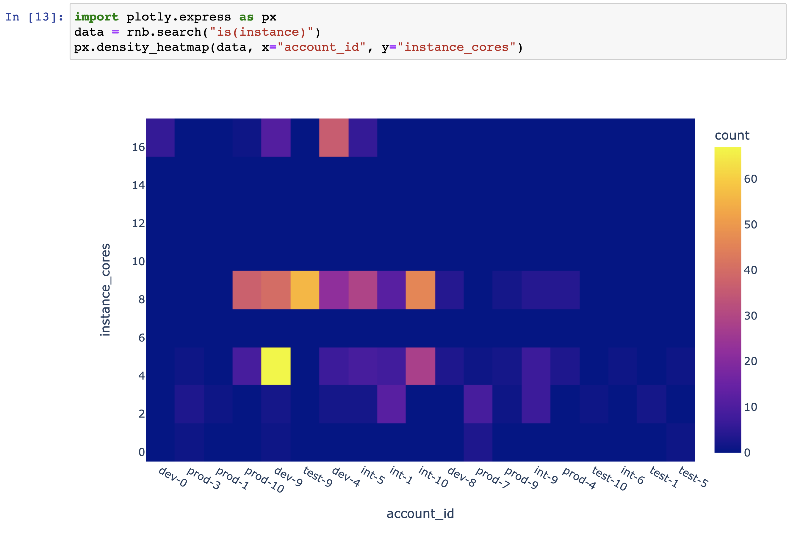
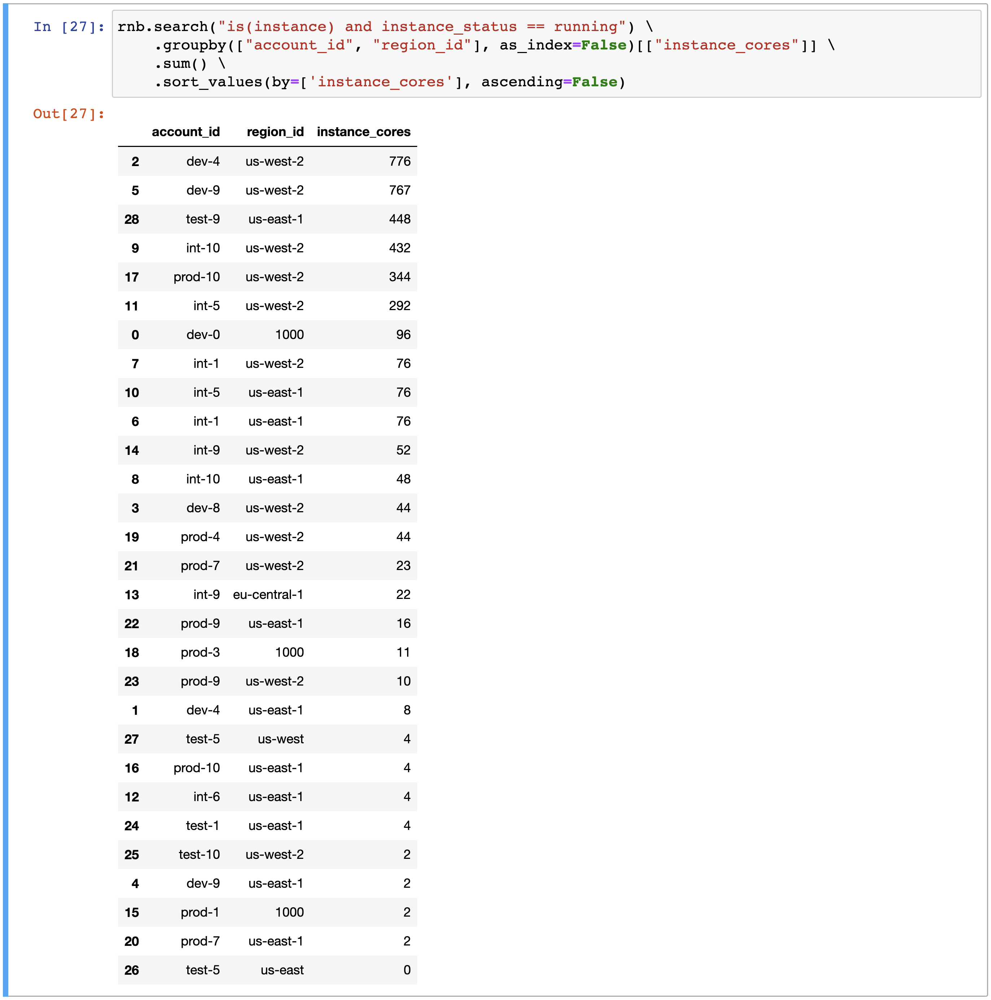

# Resotonotebook

Today I'm happy to present resotonotebook, a tool for visualizing and exploring the Resoto graph.

With it, you can make heatmaps, build graphs, perform data aggregations, and much more.

Let's dive into examples:

## Examples

### Heatmaps

Heatmaps are useful to see how resources are clustered. For instance, we can make a heatmap of the number of EC2 instances per core count per account:



This heatmap makes it easy to spot outliers, for example when someone played around with an expensive cluster and forgot to shut it down. Then you can easily clean it up using resoto.

### Graphs

Sometimes you're interested in the relationships between resources. Let's say you want to remove the database, but you're not sure which other resources this will impact. With resotonotebook, you can put the resource and its relations under the microscope and have a clear picture of what's going on.

Let's make a graph of a cloud called `do` (DigitalOcean) and all its successor resources 2 levels deep:


### Aggregations

With resotonotebook, you can rely on the power of Pandas, a popular python package for data analysis. To make an example, let's aggregate the number of cores of running instances per account per region:



With this information, we can quickly identify the most expensive accounts to take cost reduction measures.

I hope at this point resotonotebook whetted your appetite. Let's install it and start playing with it!

## Installation

Installation is simple. We need to install the jupyter notebook and the resotonotebook packages. Just run the following command in your terminal:

```bash
pip install notebook resotonotebook
```

And you're good to go! Just one note: you need access to a running instance of resotocore. If you don't have it yet, see the [resoto documentation](https://resoto.com/docs/getting-started) for the installation instructions.

## Next steps

Now that you have resotonotebook installed, what's next? One option is to clone the [example](https://github.com/someengineering/resotonotebook/blob/main/examples/example.ipynb) notebook and modify it for your needs:

```bash
git checkout git@github.com:someengineering/resotonotebook.git
cd resotonotebook/examples
jupyter notebook
```

Happy exploring!
